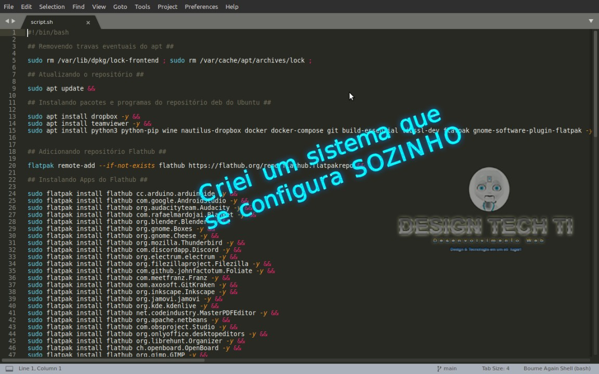

# Pós-Instalação do SO

Automatização de instalação do Ubuntu

Certique-se do arquivo ter permissões de execução.

	chmod +x ./script.sh

Para utilizar o Script, basta rodar o comando:

	sudo ./script.sh

Este repositório ainda apresenta uma lista de programas para se basear no download.